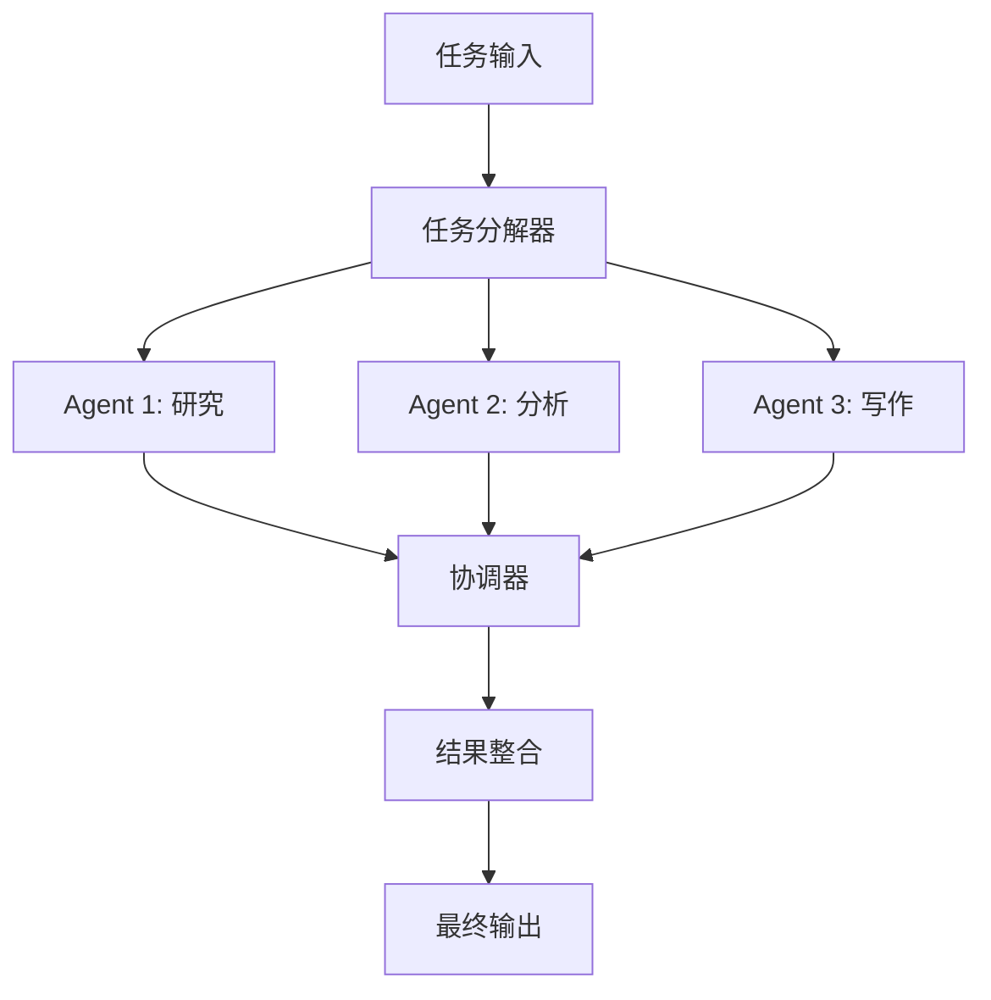
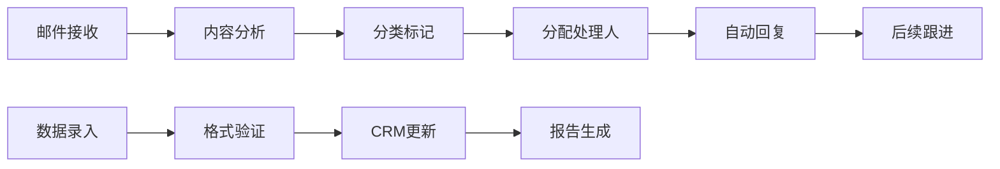
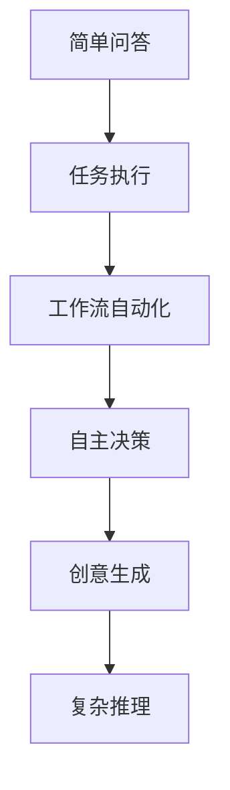
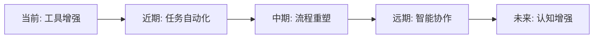

# 🤖 AI Agent Market Map - AI智能体市场全景图

> **深度解析AI Agent生态系统：从基础设施到应用层的完整图谱**

<div align="center">


**全面分析AI智能体生态系统的基础设施与应用场景**

</div>

---

## 📋 目录

- [🎯 概述](#概述)
- [🧱 基础设施层 (Infrastructure)](#基础设施层-infrastructure)
- [💼 应用层 (Horizontal Applications)](#应用层-horizontal-applications)
- [🚀 技术趋势分析](#技术趋势分析)
- [💡 选型建议](#选型建议)
- [🔮 未来展望](#未来展望)

---

## 🎯 概述

AI Agent Market Map展示了当前AI智能体生态系统的完整图景。这个生态系统分为两大层次：

1. **基础设施层 (Infrastructure)** - 提供构建、部署和运行AI Agent所需的技术组件
2. **应用层 (Horizontal Applications)** - 面向特定行业和功能的AI Agent应用

整个市场正在快速发展，从单一的聊天机器人evolving到能够执行复杂任务的自主智能体。

---

## 🧱 基础设施层 (Infrastructure)

基础设施层为AI Agent的开发和运行提供核心技术支撑，包含9个关键组件：

### 🛠️ 1. AI Agent Development Platforms
**AI智能体开发平台**

提供构建和部署智能体的核心平台和框架：

#### 🏆 主要厂商

| 公司 | 核心特色 | 适用场景 |
|------|---------|----------|
| **LangChain** | 最流行的LLM应用开发框架 | 快速原型开发、RAG应用 |
| **OpenAI** | GPT模型 + 官方API | 高质量对话、代码生成 |
| **Cohere** | 企业级LLM服务 | 企业部署、多语言支持 |
| **ADEPT** | 行动导向的AI系统 | 自主任务执行 |
| **Kore.ai** | 对话式AI平台 | 企业客服、虚拟助手 |
| **E2B** | 代码执行环境 | 代码解释、沙盒运行 |
| **GripTape** | 模块化Agent框架 | 复杂工作流编排 |
| **Stack** | 全栈AI开发平台 | 端到端AI应用开发 |

#### 💻 技术栈对比

```python
# LangChain 示例
from langchain.agents import initialize_agent
from langchain.llms import OpenAI

agent = initialize_agent(
    tools=[search_tool, calculator_tool],
    llm=OpenAI(),
    agent="zero-shot-react-description"
)
```

```javascript
// E2B 代码执行示例
import { CodeInterpreter } from '@e2b/code-interpreter'

const sandbox = await CodeInterpreter.create()
const result = await sandbox.notebook.execCell('print("Hello AI Agent!")')
```

### 🤝 2. Multi-agent & Orchestration
**多智能体协作与编排**

实现多个AI Agent之间的协调和任务分工：

#### 🔗 核心厂商

| 平台 | 特点 | 使用场景 |
|------|------|----------|
| **CrewAI** | 角色分工明确的多Agent系统 | 内容创作团队、研发流程 |
| **Fetch.ai** | 去中心化自主Agent网络 | 物联网、供应链自动化 |
| **Martian** | 企业级多Agent编排 | 复杂业务流程自动化 |
| **Aaru** | 智能任务分解与分配 | 项目管理、团队协作 |

#### 🔄 工作流程图



### 🔐 3. Authentication
**身份认证**

为AI Agent提供安全的身份验证和访问控制：

- **ANON**: 匿名身份验证解决方案
- **Keet**: 基于区块链的去中心化身份认证

### 🔍 4. Web Search & Tool Use
**网页搜索与工具调用**

让AI Agent能够访问实时信息和外部工具：

#### 🌐 搜索与工具平台

| 服务 | 功能 | 优势 |
|------|------|------|
| **Tavily** | AI优化的搜索API | 高质量搜索结果、结构化数据 |
| **Browserbase** | 无头浏览器服务 | 网页自动化、动态内容抓取 |
| **Composio** | 工具集成平台 | 200+工具集成、统一API |
| **Exa** | 语义搜索引擎 | 理解意图的智能搜索 |

#### 🛠️ 集成示例

```python
# Tavily搜索集成
from tavily import TavilyClient

tavily = TavilyClient(api_key="your-api-key")
result = tavily.search(
    query="AI Agent market trends 2025",
    search_depth="advanced"
)
```

### 📊 5. Data Curation
**数据整理**

为AI Agent提供数据预处理和知识库构建能力：

- **LlamaIndex**: RAG应用的数据索引和检索
- **Vectara**: 企业级向量搜索平台

### 💳 6. Payments
**支付接口**

集成支付功能，让AI Agent能够处理交易：

| 服务 | 特色 | 应用场景 |
|------|------|----------|
| **Stripe** | 传统支付巨头 | 电商、订阅服务 |
| **Payman** | AI原生支付 | 自动化交易 |
| **Skyfire** | 加密货币支付 | Web3应用 |

### 🧠 7. Memory
**记忆机制**

提供AI Agent的长期记忆和上下文管理：

#### 🗄️ 记忆类型

```python
# Zep记忆集成示例
from zep_python import ZepClient

client = ZepClient(base_url="http://localhost:8000")

# 存储对话记忆
session = client.memory.add_session(
    session_id="user123",
    metadata={"user_id": "123", "agent_type": "assistant"}
)

# 检索相关记忆
memory = client.memory.get_session(session_id="user123")
```

#### 📈 记忆架构

- **短期记忆**: 当前对话上下文
- **长期记忆**: 用户偏好、历史交互
- **工作记忆**: 当前任务状态
- **知识记忆**: 领域专业知识

### 📊 8. Evaluation & Observability
**评估与可观测性**

监控和优化AI Agent的性能：

#### 🔍 监控维度

| 平台 | 监控重点 | 功能特色 |
|------|----------|----------|
| **Arize** | 模型性能监控 | 数据漂移检测、偏差分析 |
| **Weights & Biases** | 实验追踪 | 超参数优化、结果可视化 |
| **Langfuse** | LLM应用追踪 | Token使用、成本分析 |
| **Agency** | Agent行为分析 | 决策路径、成功率统计 |

#### 📊 关键指标

```yaml
性能指标:
  - 响应时间 (Response Time)
  - 任务完成率 (Task Success Rate)
  - 用户满意度 (User Satisfaction)
  - 成本效率 (Cost Efficiency)

质量指标:
  - 准确性 (Accuracy)
  - 相关性 (Relevance)
  - 一致性 (Consistency)
  - 安全性 (Safety)
```

### 🎤 9. Voice
**语音交互**

为AI Agent添加语音输入输出能力：

#### 🔊 语音技术栈

| 技术 | 厂商 | 应用场景 |
|------|------|----------|
| **TTS (文本转语音)** | ElevenLabs, OpenAI | 语音助手、播客生成 |
| **STT (语音转文本)** | Deepgram, Whisper | 语音输入、会议记录 |
| **对话AI** | Retell AI, FIXIE | 电话客服、语音交互 |
| **语音合成** | Synthflow | 个性化语音定制 |

---

## 💼 应用层 (Horizontal Applications)

应用层展示了AI Agent在各个垂直领域和业务功能中的具体应用：

### 🎯 1. Productivity & Personal Assistants
**生产力与个人助理**

面向个人用户的AI助理应用：

#### 🌟 明星产品

| 产品 | 公司 | 核心功能 | 用户群体 |
|------|------|----------|----------|
| **ChatGPT** | OpenAI | 通用对话、写作、编程 | 个人用户、专业人士 |
| **Claude** | Anthropic | 长文本处理、分析推理 | 研究人员、分析师 |
| **Perplexity** | Perplexity AI | 搜索增强问答 | 学生、研究者 |
| **HyperWrite** | HyperWrite | AI写作助手 | 内容创作者 |
| **Personal AI** | Personal AI | 个性化AI助手 | 个人用户 |

#### 💡 使用场景

```markdown
日常场景:
- 📝 写作辅助: 邮件、报告、创意内容
- 🔍 信息检索: 快速找到准确信息
- 📊 数据分析: 简单的数据处理和可视化
- 🗓️ 日程管理: 会议安排、提醒设置
- 🎓 学习辅导: 概念解释、练习生成
```

### 🏢 2. General Enterprise Workflows
**企业通用工作流**

自动化企业内部流程和任务：

#### 🔧 核心平台

| 平台 | 特色功能 | 自动化能力 |
|------|----------|------------|
| **Bardeen** | 无代码自动化 | 浏览器操作、数据同步 |
| **Orby** | AI工作流录制 | 学习用户操作模式 |
| **SuperAGI** | 开源Agent框架 | 自定义工作流编排 |
| **Aisera** | 企业AI平台 | IT服务台、HR自动化 |

#### 🔄 自动化流程示例



### 📞 3. Customer Service
**客户服务**

AI驱动的客服解决方案：

#### 🎧 客服AI平台

| 平台 | 技术特点 | 部署方式 |
|------|----------|----------|
| **Sierra** | 对话式AI客服 | 云端SaaS |
| **Cognigy** | 企业级对话平台 | 混合云部署 |
| **Voiceflow** | 可视化对话设计 | 低代码平台 |
| **Decagon** | 技术支持专用 | API集成 |

#### 📊 客服效果提升

```yaml
传统客服 vs AI客服:
  响应时间: 
    - 传统: 5-10分钟
    - AI: <30秒
  
  处理容量:
    - 传统: 1对1
    - AI: 1对无限
  
  可用性:
    - 传统: 8小时/天
    - AI: 24小时/天
  
  成本效益:
    - 传统: 高人力成本
    - AI: 低运营成本
```

### 💻 4. Software Development
**软件开发辅助**

AI Agent在软件开发全生命周期的应用：

#### 🛠️ 开发工具

| 工具 | 功能领域 | 核心能力 |
|------|----------|----------|
| **Cursor** | AI代码编辑器 | 智能补全、代码生成 |
| **Replit** | 在线开发环境 | AI结对编程 |
| **Tusk** | 任务自动化 | Bug修复、代码重构 |
| **All Hands** | 软件工程Agent | 端到端开发流程 |
| **Magic** | AI编程助手 | 代码解释、文档生成 |
| **Autify** | 自动化测试 | 测试用例生成 |

#### 👨‍💻 开发流程优化

```python
# AI辅助代码生成示例
def generate_api_endpoint(description: str):
    """
    根据描述自动生成API端点代码
    """
    # AI Agent分析需求
    requirements = analyze_requirements(description)
    
    # 生成代码框架
    code = generate_code_structure(requirements)
    
    # 添加错误处理
    code = add_error_handling(code)
    
    # 生成测试用例
    tests = generate_test_cases(code)
    
    return code, tests
```

### 📊 5. Data Analysis
**数据分析**

自然语言驱动的数据分析和洞察：

#### 📈 分析平台

- **Inflection**: 对话式数据探索
- **Paradigm**: 投资决策支持
- **Connectly AI**: 客户数据分析

#### 🔍 分析能力

```sql
-- 自然语言转SQL示例
用户问题: "过去三个月哪个产品销量最好？"

生成SQL:
SELECT 
    product_name,
    SUM(quantity) as total_sales
FROM sales 
WHERE sale_date >= DATE_SUB(NOW(), INTERVAL 3 MONTH)
GROUP BY product_name
ORDER BY total_sales DESC
LIMIT 1;
```

### 💰 6. Accounting
**会计财务**

AI在财务管理和会计处理中的应用：

- **Basis**: 自动记账和财务分析
- **Hypatos**: 发票处理和费用管理

### 🔒 7. Cybersecurity
**网络安全**

AI Agent在网络安全防护中的作用：

#### 🛡️ 安全防护

| 平台 | 安全能力 | 应用场景 |
|------|----------|----------|
| **Dropzone AI** | 威胁检测 | SOC自动化 |
| **Torq** | 安全编排 | 事件响应 |
| **RadiantSecurity** | 行为分析 | 内部威胁检测 |
| **Simbian** | 智能防护 | 零信任架构 |

### 💼 8. Sales
**销售**

AI驱动的销售流程优化：

#### 📈 销售工具

| 工具 | 主要功能 | 价值提升 |
|------|----------|----------|
| **Clay** | 潜客挖掘 | 自动化线索收集 |
| **Qualified** | 对话式营销 | 实时客户互动 |
| **SIDR** | SDR自动化 | 邮件外呼自动化 |
| **Bounti** | 销售激励 | 绩效追踪优化 |

### 👥 9. HR
**人力资源**

AI在人力资源管理中的创新应用：

#### 🎯 HR场景

```yaml
招聘流程优化:
  - 简历筛选: 自动匹配职位要求
  - 面试安排: 智能时间协调
  - 候选人评估: 多维度能力分析
  - 背景调查: 自动化验证流程

员工管理:
  - 绩效评估: 数据驱动的评价体系
  - 培训推荐: 个性化学习路径
  - 离职预测: 员工流失风险分析
  - 薪酬优化: 市场对标分析
```

### 📱 10. Marketing
**营销**

AI Agent在市场营销中的应用：

- **Ability AI**: 智能营销自动化
- **Firsthand**: 客户洞察分析

### 🔍 11. Web Research & Data Extraction
**网页研究与数据提取**

大规模网络数据采集和分析：

- **Lutra**: 智能网页抓取
- **Reworkd**: 自动化数据收集

---

## 🚀 技术趋势分析

### 📈 市场发展趋势

#### 1. **基础设施成熟化**
- 开发平台标准化
- 多Agent协作能力增强
- 安全性和可观测性提升

#### 2. **应用场景扩展**
- 从客服扩展到全业务流程
- 垂直行业深度定制
- 个人助理智能化升级

#### 3. **技术能力进化**


### 🔮 新兴技术方向

#### **1. Multi-Modal Agents**
- 视觉、语音、文本多模态融合
- 更自然的人机交互体验

#### **2. Autonomous Agents**
- 更强的自主规划能力
- 长期目标导向的行为

#### **3. Specialized Agents**
- 领域专家级能力
- 行业知识深度集成

---

## 💡 选型建议

### 🎯 基于需求场景的选择策略

#### **快速原型开发**
```python
推荐技术栈:
- 开发平台: LangChain + OpenAI API
- 搜索工具: Tavily
- 记忆存储: Zep
- 监控评估: Langfuse
```

#### **企业级部署**
```python
推荐技术栈:
- 开发平台: Cohere + 私有部署
- 多Agent: CrewAI
- 身份认证: 企业SSO集成
- 可观测性: Arize + W&B
```

#### **消费级应用**
```python
推荐技术栈:
- 开发平台: OpenAI API
- 语音交互: ElevenLabs + Deepgram
- 支付集成: Stripe
- 用户分析: 自建analytics
```

### 🔧 技术选型矩阵

| 需求类型 | 开发复杂度 | 推荐平台 | 部署方式 |
|----------|------------|----------|----------|
| **MVP原型** | 低 | LangChain + OpenAI | 云端SaaS |
| **企业应用** | 中 | 自建 + Cohere | 混合云 |
| **大规模产品** | 高 | 完全自研 | 私有云 |

---

## 🔮 未来展望

### 🌟 技术发展预测

#### **短期 (2025-2026)**
- 多Agent协作能力大幅提升
- 工具调用和API集成标准化
- 成本进一步降低

#### **中期 (2026-2028)**
- 真正的自主Agent出现
- 行业专用Agent普及
- 人机协作模式成熟

#### **长期 (2028+)**
- AGI级别的通用Agent
- 完全自主的数字员工
- 人类工作方式根本性改变

### 💫 生态演进方向



### 🚀 投资和创业机会

#### **基础设施层机会**
- 专业化Agent开发工具
- 行业特定的Agent平台
- 安全和合规解决方案

#### **应用层机会**
- 垂直行业深度应用
- 新兴使用场景探索
- 用户体验创新

---

## 📚 相关资源

### 🔗 重要链接
- [LangChain官方文档](https://python.langchain.com/)
- [OpenAI API文档](https://platform.openai.com/docs)
- [Anthropic Claude文档](https://docs.anthropic.com/)
- [CrewAI框架](https://crewai.com/)

### 📖 推荐阅读
- 《Building LLM Applications》
- 《AI Agent Architecture Patterns》
- 《Enterprise AI Implementation Guide》

### 🎓 学习路径
1. **基础概念**: LLM、Prompt Engineering
2. **开发框架**: LangChain、LlamaIndex
3. **多Agent系统**: CrewAI、AutoGen
4. **生产部署**: 监控、评估、优化

---

<div align="center">

**🤖 AI Agent生态系统正在快速发展，把握趋势，拥抱未来！**

[](https://github.com/Joseph19820124/ai-agent-landscape)
[](https://github.com/Joseph19820124/ai-agent-landscape)

*本文档将持续更新，跟踪AI Agent领域的最新发展*

</div>