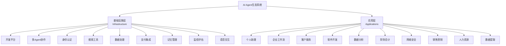
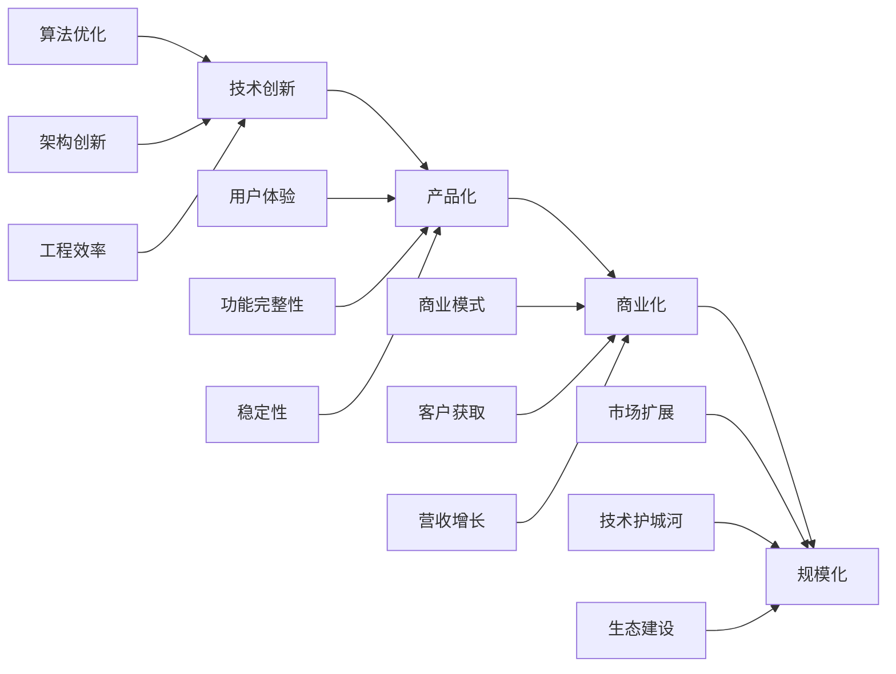

# 🤖 AI Agent Landscape - AI智能体生态全景

<div align="center">


**全面解析AI智能体市场生态系统 - 从基础设施到垂直应用的完整图谱**

</div>

---

## 🎯 项目简介

本项目深度分析AI Agent市场全景图，为开发者、投资者和企业决策者提供全面的生态系统指南。我们将整个AI Agent生态分为基础设施层和应用层，详细解析各个细分领域的主要厂商、技术特点和发展趋势。

## 📊 市场概览

AI Agent生态系统正在经历快速发展，从简单的聊天机器人演进到能够执行复杂任务的自主智能体：



## 📚 文档结构

### 📋 [AI Agent Market Map 完整分析](./AI-Agent-Market-Map.md)

这份详细分析包含：

#### 🧱 基础设施层 (Infrastructure)
1. **AI Agent开发平台** - LangChain, OpenAI, Cohere等
2. **多Agent协作** - CrewAI, Fetch.ai等
3. **身份认证** - ANON, Keet等
4. **搜索工具** - Tavily, Browserbase等
5. **数据处理** - LlamaIndex, Vectara等
6. **支付集成** - Stripe, Skyfire等
7. **记忆管理** - Zep, Letta等
8. **监控评估** - Arize, Langfuse等
9. **语音交互** - ElevenLabs, Deepgram等

#### 💼 应用层 (Applications)
1. **生产力助理** - ChatGPT, Claude, Perplexity等
2. **企业工作流** - Bardeen, Orby, SuperAGI等
3. **客户服务** - Sierra, Cognigy, Voiceflow等
4. **软件开发** - Cursor, Replit, Tusk等
5. **数据分析** - Inflection, Paradigm等
6. **财务会计** - Basis, Hypatos等
7. **网络安全** - Dropzone AI, Torq等
8. **销售营销** - Clay, Qualified等
9. **人力资源** - Apriora, Mercor等
10. **数据提取** - Lutra, Reworkd等

## 🎯 核心洞察

### 📈 市场趋势
- **基础设施成熟化**: 开发工具标准化，多Agent协作能力增强
- **应用场景扩展**: 从客服扩展到全业务流程自动化
- **垂直行业深化**: 针对特定行业的专业Agent解决方案
- **成本效益提升**: 开发和运营成本持续降低

### 🏆 明星厂商分析

#### 基础设施层领导者
| 类别 | 领导厂商 | 市场地位 | 技术优势 |
|------|----------|----------|----------|
| **开发平台** | LangChain | 🥇 开源生态第一 | 丰富的工具链、活跃社区 |
| **模型提供** | OpenAI | 🥇 技术标杆 | GPT系列、API稳定性 |
| **多Agent** | CrewAI | 🥇 协作专家 | 角色分工、任务编排 |
| **搜索工具** | Tavily | 🥇 AI优化搜索 | 结构化结果、高质量数据 |

#### 应用层独角兽
| 领域 | 代表厂商 | 估值/地位 | 核心能力 |
|------|----------|-----------|----------|
| **通用助理** | OpenAI | $80B+ | ChatGPT生态 |
| **企业AI** | Anthropic | $15B+ | Claude系列 |
| **搜索问答** | Perplexity | $3B+ | 实时搜索增强 |
| **代码助手** | Cursor | 独角兽潜力 | AI原生编辑器 |

## 🛠️ 技术选型指南

### 快速入门推荐栈
```python
# 适合初学者和MVP开发
技术栈组合:
  开发框架: LangChain
  模型服务: OpenAI GPT-4
  搜索增强: Tavily API
  记忆存储: Zep
  监控评估: LangSmith

部署方式: 云端SaaS
开发周期: 1-2周
成本预估: $100-500/月
```

### 企业级推荐栈
```python
# 适合大型企业和B2B产品
技术栈组合:
  开发框架: 自研 + Cohere
  多Agent: CrewAI + 自定义编排
  安全认证: 企业SSO集成
  可观测性: Arize + W&B
  数据处理: LlamaIndex + 私有向量库

部署方式: 混合云/私有云
开发周期: 3-6个月
成本预估: $10K-100K/月
```

### 创业公司推荐栈
```python
# 适合AI-first创业公司
技术栈组合:
  开发框架: LangChain + 自研
  模型服务: OpenAI + Anthropic
  工具集成: Composio
  语音交互: ElevenLabs + Deepgram
  支付系统: Stripe

部署方式: 云原生
开发周期: 2-4个月  
成本预估: $1K-10K/月
```

## 🚀 发展机会分析

### 💰 投资热点
1. **基础设施层**
   - 🔥 多Agent协作平台
   - 🔥 行业专用开发工具
   - 🔥 Agent安全和合规
   - 🔥 性能监控和优化

2. **应用层**
   - 🌟 垂直行业Agent
   - 🌟 新兴使用场景
   - 🌟 用户体验创新
   - 🌟 企业级解决方案

### 🎯 创业方向


## 📊 市场数据

### 2025年市场规模预测
| 细分市场 | 市场规模 | 增长率 | 主要驱动因素 |
|----------|----------|--------|--------------|
| **开发平台** | $2.5B | 85% | 开发者需求激增 |
| **企业应用** | $8.3B | 120% | 数字化转型加速 |
| **个人助理** | $3.1B | 95% | 消费者接受度提升 |
| **垂直行业** | $4.7B | 150% | 专业化需求增长 |

### 融资情况 (2024-2025)
```yaml
顶级融资案例:
  OpenAI: $6.6B (Series C)
  Anthropic: $4B (Series C) 
  Perplexity: $520M (Series B)
  Sierra: $175M (Series B)
  CrewAI: $18M (Series A)
  
总融资额: $50B+ (2024年)
投资机构: a16z, Sequoia, GV, Microsoft等
```

## 🔮 未来展望

### 短期趋势 (2025-2026)
- ✅ 多Agent协作成为标配
- ✅ 工具调用能力大幅提升
- ✅ 成本降低10倍以上
- ✅ 企业采用率突破50%

### 中期愿景 (2026-2028)
- 🚀 真正自主的Agent出现
- 🚀 行业专用Agent普及
- 🚀 人机协作模式成熟
- 🚀 新的工作方式诞生

### 长期变革 (2028+)
- 🌟 AGI级通用Agent
- 🌟 完全数字化员工
- 🌟 经济模式根本改变
- 🌟 人类角色重新定义

## 📖 学习资源

### 🎓 推荐课程
- [LangChain官方教程](https://python.langchain.com/docs/get_started)
- [OpenAI API实战指南](https://platform.openai.com/docs)
- [CrewAI多Agent开发](https://docs.crewai.com/)
- [AI Agent架构设计](https://www.deeplearning.ai/)

### 📚 必读资料
- 《Building LLM Applications for Production》
- 《AI Agent Design Patterns》
- 《Enterprise AI Implementation》
- 《The Future of AI Agents》

### 🛠️ 实践项目
1. **入门项目**: 构建个人助理Agent
2. **进阶项目**: 多Agent协作系统
3. **企业项目**: 业务流程自动化
4. **创新项目**: 垂直领域专家Agent

## 🤝 贡献指南

我们欢迎社区贡献，帮助完善这份AI Agent生态图谱：

### 📝 贡献方式
- 🔄 更新厂商信息和产品动态
- 📊 补充市场数据和案例研究
- 🆕 添加新兴技术和趋势分析
- 🔧 分享实践经验和最佳实践

### 📋 贡献规范
1. Fork本仓库
2. 创建feature分支
3. 提交详细的变更说明
4. 创建Pull Request

## 📞 联系我们

- 📧 Email: [项目邮箱]
- 💬 Discord: [社区链接]
- 🐦 Twitter: [官方账号]
- 📺 YouTube: [教程频道]

---

## 📄 许可证

本项目采用 [MIT License](LICENSE) 开源协议

## 🙏 致谢

感谢所有为AI Agent生态系统发展做出贡献的开发者、研究者和企业。

---

<div align="center">

**🚀 AI Agent时代已经到来，让我们一起探索无限可能！**

[](https://github.com/Joseph19820124/ai-agent-landscape)
[](https://github.com/Joseph19820124/ai-agent-landscape)
[](https://github.com/Joseph19820124/ai-agent-landscape)

*持续更新中，关注获取最新AI Agent行业动态*

</div>