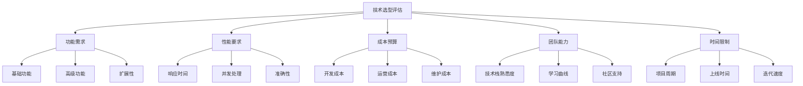
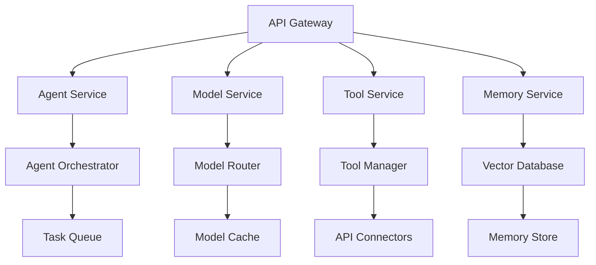
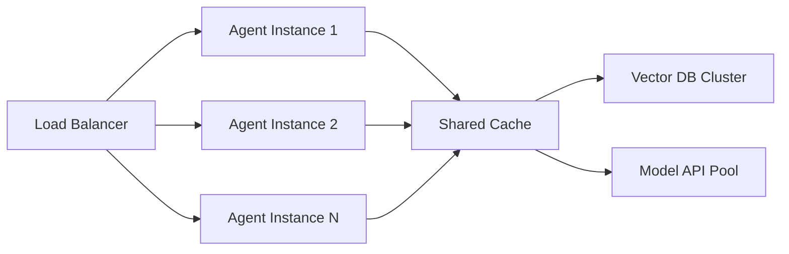

# 🛠️ AI Agent技术选型指南

> **全面对比分析AI Agent开发技术栈，帮助您做出最佳选择**

---

## 📋 目录

- [🎯 选型框架](#选型框架)
- [🧱 基础设施层对比](#基础设施层对比)
- [💼 应用场景选型](#应用场景选型)
- [💰 成本效益分析](#成本效益分析)
- [🚀 部署策略建议](#部署策略建议)
- [📊 性能优化指南](#性能优化指南)

---

## 🎯 选型框架

### 核心评估维度



---

## 🧱 基础设施层对比

### 1. AI Agent开发平台

#### 🏆 主流平台对比

| 平台 | 开源程度 | 学习曲线 | 生态丰富度 | 企业支持 | 推荐指数 |
|------|----------|----------|------------|----------|----------|
| **LangChain** | ⭐⭐⭐⭐⭐ | ⭐⭐⭐ | ⭐⭐⭐⭐⭐ | ⭐⭐⭐ | ⭐⭐⭐⭐⭐ |
| **OpenAI API** | ⭐⭐ | ⭐⭐⭐⭐⭐ | ⭐⭐⭐⭐ | ⭐⭐⭐⭐⭐ | ⭐⭐⭐⭐⭐ |
| **Cohere** | ⭐⭐ | ⭐⭐⭐⭐ | ⭐⭐⭐ | ⭐⭐⭐⭐⭐ | ⭐⭐⭐⭐ |
| **E2B** | ⭐⭐⭐ | ⭐⭐⭐⭐ | ⭐⭐⭐ | ⭐⭐⭐ | ⭐⭐⭐⭐ |
| **GripTape** | ⭐⭐⭐⭐ | ⭐⭐⭐ | ⭐⭐⭐ | ⭐⭐⭐ | ⭐⭐⭐⭐ |

#### 📊 详细对比分析

**LangChain**
```python
# 优势
✅ 最丰富的工具生态
✅ 活跃的开源社区
✅ 详细的文档和教程
✅ 支持多种LLM提供商

# 劣势
❌ 版本更新频繁，API不稳定
❌ 性能优化有待提升
❌ 企业级功能相对较少

# 适用场景
🎯 快速原型开发
🎯 学习和研究项目
🎯 中小型应用
```

**OpenAI API**
```python
# 优势
✅ 模型质量业界领先
✅ API稳定性极高
✅ 文档清晰，易于集成
✅ 企业级支持完善

# 劣势
❌ 成本相对较高
❌ 依赖单一供应商
❌ 定制化能力有限

# 适用场景
🎯 对质量要求极高的应用
🎯 快速上线的商业产品
🎯 需要稳定性的企业应用
```

### 2. 多Agent协作平台

#### 🤝 协作平台选型矩阵

| 平台 | 协作模式 | 编排复杂度 | 性能表现 | 学习成本 | 企业就绪度 |
|------|----------|------------|----------|----------|------------|
| **CrewAI** | 角色分工 | 中等 | 高 | 低 | 高 |
| **AutoGen** | 对话式 | 高 | 中 | 高 | 中 |
| **Fetch.ai** | 去中心化 | 高 | 高 | 高 | 中 |
| **Martian** | 工作流 | 低 | 中 | 低 | 高 |

#### 🔄 协作模式对比

```yaml
CrewAI模式:
  特点: 明确的角色分工
  优势: 易于理解和调试
  劣势: 灵活性相对较低
  
AutoGen模式:
  特点: 多轮对话协作
  优势: 灵活性高，可处理复杂任务
  劣势: 对话可能发散，难以控制

Fetch.ai模式:
  特点: 去中心化自主Agent
  优势: 高度自主，适合大规模部署
  劣势: 复杂性高，调试困难
```

### 3. 搜索与工具集成

#### 🔍 搜索工具对比

| 工具 | 搜索质量 | 速度 | 成本 | API稳定性 | 定制化能力 |
|------|----------|------|------|-----------|------------|
| **Tavily** | ⭐⭐⭐⭐⭐ | ⭐⭐⭐⭐ | ⭐⭐⭐ | ⭐⭐⭐⭐ | ⭐⭐⭐⭐ |
| **Browserbase** | ⭐⭐⭐⭐ | ⭐⭐⭐ | ⭐⭐ | ⭐⭐⭐⭐ | ⭐⭐⭐⭐⭐ |
| **Exa** | ⭐⭐⭐⭐ | ⭐⭐⭐⭐⭐ | ⭐⭐⭐⭐ | ⭐⭐⭐ | ⭐⭐⭐ |
| **Composio** | ⭐⭐⭐ | ⭐⭐⭐⭐ | ⭐⭐⭐⭐ | ⭐⭐⭐⭐ | ⭐⭐⭐⭐⭐ |

#### 🛠️ 工具集成策略

```python
# 基础搜索需求
推荐: Tavily
理由: 专为AI优化，结果质量高

# 复杂网页操作
推荐: Browserbase
理由: 支持JavaScript渲染，功能完整

# 大规模工具集成
推荐: Composio
理由: 200+工具集成，统一API

# 成本敏感项目
推荐: 自建搜索 + Google API
理由: 成本可控，灵活定制
```

---

## 💼 应用场景选型

### 🚀 按项目类型推荐

#### 1. MVP/原型项目
```yaml
推荐技术栈:
  开发框架: LangChain
  模型服务: OpenAI GPT-4o-mini
  搜索工具: Tavily
  数据存储: SQLite + 向量数据库
  部署平台: Vercel/Railway

开发周期: 1-2周
团队规模: 1-2人
预算范围: $500-2000
成功率: 90%+
```

#### 2. 企业级应用
```yaml
推荐技术栈:
  开发框架: 自研 + LangChain
  模型服务: OpenAI + Anthropic (多模型)
  多Agent: CrewAI
  监控工具: Arize + LangSmith
  部署方式: 混合云

开发周期: 3-6个月
团队规模: 5-10人
预算范围: $50K-200K
成功率: 75%+
```

#### 3. AI-First产品
```yaml
推荐技术栈:
  开发框架: 完全自研
  模型服务: 多提供商集成
  基础设施: 自建向量数据库
  监控评估: 全链路监控
  部署方式: 云原生

开发周期: 6-12个月
团队规模: 10-20人
预算范围: $200K-1M
成功率: 60%+
```

### 🎯 按行业垂直推荐

#### 金融服务
```python
核心需求:
- 高安全性和合规性
- 低延迟响应
- 数据隐私保护
- 风险控制

推荐方案:
  模型: 私有部署的开源模型
  数据: 本地向量数据库
  安全: 端到端加密
  监控: 实时风险监测
```

#### 医疗健康
```python
核心需求:
- 医疗知识准确性
- 监管合规要求
- 患者隐私保护
- 可解释性

推荐方案:
  模型: 医疗专用微调模型
  知识库: 医学文献RAG
  验证: 多层验证机制
  追踪: 完整决策路径记录
```

#### 电商零售
```python
核心需求:
- 个性化推荐
- 实时库存查询
- 多渠道集成
- 成本控制

推荐方案:
  模型: OpenAI + 本地embedding
  数据: 实时同步系统
  集成: API网关统一管理
  优化: 智能缓存策略
```

---

## 💰 成本效益分析

### 📊 成本构成分析

#### 开发阶段成本 (一次性)
```yaml
人力成本 (60-70%):
  - 技术架构师: $150K+
  - 后端开发: $120K+
  - AI工程师: $180K+
  - 前端开发: $100K+

技术成本 (20-25%):
  - 开发工具许可: $5K-20K
  - 云服务资源: $2K-10K
  - 第三方API: $1K-5K

其他成本 (10-15%):
  - 项目管理: $10K-30K
  - 测试验证: $5K-15K
```

#### 运营阶段成本 (月度)
```yaml
模型调用费用 (40-50%):
  - OpenAI API: $0.01-0.06/1K tokens
  - Anthropic: $0.008-0.024/1K tokens
  - 自部署模型: $0.001-0.01/1K tokens

基础设施 (30-40%):
  - 云服务器: $500-5000/月
  - 数据库: $200-2000/月
  - CDN/存储: $100-1000/月

人力维护 (20-30%):
  - 运维工程师: $10K-15K/月
  - 算法优化: $15K-25K/月
```

### 📈 ROI计算模型

#### 企业客服应用案例
```python
传统人工客服成本:
- 客服人员: 10人 × $4K/月 = $40K/月
- 管理成本: $10K/月
- 总成本: $50K/月

AI Agent方案成本:
- 开发成本: $200K (一次性)
- 运营成本: $5K/月
- 维护成本: $10K/月
- 总运营成本: $15K/月

ROI分析:
- 月度节省: $35K
- 回本周期: 6个月
- 年化ROI: 210%
```

#### 软件开发助手案例
```python
传统开发效率:
- 10名开发者
- 平均效率: 100%
- 总产出: 10人×月

AI辅助开发效率:
- 10名开发者 + AI Agent
- 平均效率提升: 40%
- 总产出: 14人×月等价

成本效益:
- AI工具成本: $2K/月
- 效率提升价值: $40K/月 (4人×$10K)
- 净收益: $38K/月
- ROI: 1900%
```

---

## 🚀 部署策略建议

### ☁️ 部署架构选择

#### 1. 云端SaaS部署
```yaml
适用场景:
- MVP和小型应用
- 快速验证需求
- 团队技术实力有限

优势:
- 快速上线 (1-2周)
- 成本可控
- 维护简单

劣势:
- 定制化限制
- 数据安全风险
- 长期成本较高

推荐平台:
- Vercel + OpenAI
- Railway + LangChain
- Heroku + Anthropic
```

#### 2. 混合云部署
```yaml
适用场景:
- 企业级应用
- 数据敏感场景
- 需要高度定制

优势:
- 安全性高
- 可定制性强
- 性能可控

劣势:
- 部署复杂
- 维护成本高
- 技术要求高

推荐架构:
- AWS/Azure + 私有模型
- Kubernetes + 微服务
- 边缘计算 + 云端协同
```

#### 3. 私有化部署
```yaml
适用场景:
- 金融、医疗等强监管行业
- 大型企业内部应用
- 数据绝对不能出境

优势:
- 数据完全可控
- 合规性最强
- 性能最优

劣势:
- 投入成本巨大
- 技术门槛极高
- 维护复杂度高

推荐方案:
- 私有云 + 开源模型
- 自建GPU集群
- 完全离线部署
```

### 🏗️ 架构设计模式

#### 微服务架构


#### 事件驱动架构
```python
# 事件驱动模式优势
✅ 松耦合设计
✅ 高扩展性
✅ 容错能力强
✅ 支持异步处理

# 核心组件
🔄 Event Bus: Apache Kafka
📮 Message Queue: Redis/RabbitMQ
⚡ Stream Processing: Apache Flink
📊 Event Store: EventStore/PostgreSQL
```

---

## 📊 性能优化指南

### ⚡ 响应时间优化

#### 1. 模型调用优化
```python
# 策略1: 模型缓存
缓存层级:
- 完全匹配缓存 (100% 命中率)
- 语义相似缓存 (80% 命中率)
- 模板缓存 (60% 命中率)

效果:
- 响应时间: 5s → 0.5s
- 成本降低: 70%
```

#### 2. 并发处理优化
```python
# 策略2: 异步处理
技术栈:
- FastAPI + async/await
- Celery + Redis
- WebSocket实时推送

效果:
- 并发能力: 10 → 1000 QPS
- 用户体验显著提升
```

#### 3. 智能路由优化
```python
# 策略3: 请求路由
路由规则:
- 简单问题 → 小模型 (GPT-3.5)
- 复杂任务 → 大模型 (GPT-4)
- 专业领域 → 专用模型

效果:
- 成本优化: 50%
- 平均响应时间: 40% 提升
```

### 🎯 准确性优化

#### 1. RAG系统优化
```yaml
检索优化:
  - 混合检索: 关键词 + 向量
  - 重排序: Reranker模型
  - 上下文窗口: 动态调整

生成优化:
  - 多轮验证: 自我反思机制
  - 事实检查: 外部知识验证
  - 输出格式: 结构化约束
```

#### 2. 多模型集成
```python
# 集成策略
投票机制:
- 3个模型独立推理
- 结果一致性检查
- 置信度加权投票

备选策略:
- 主模型失败时切换
- 特定任务专用模型
- 人工审核机制
```

### 💸 成本优化策略

#### 1. Token使用优化
```python
优化技术:
- 提示词压缩: 减少无用token
- 上下文裁剪: 保留关键信息
- 批量处理: 降低API调用次数

节省效果:
- Token使用量: -40%
- API调用成本: -35%
```

#### 2. 模型选择优化
```yaml
成本梯度:
- GPT-4o: $0.005/1K (最贵，最好)
- GPT-4o-mini: $0.0015/1K (性价比高)
- Claude-3.5-Sonnet: $0.003/1K (中等)
- 开源模型: $0.0005/1K (最便宜)

选择策略:
- 90%请求用mini模型
- 10%复杂任务用完整模型
- 总体成本降低60%+
```

### 📈 可扩展性设计

#### 1. 水平扩展架构


#### 2. 弹性伸缩策略
```yaml
自动扩展规则:
  CPU使用率 > 70%: 扩展实例
  队列长度 > 100: 扩展实例
  响应时间 > 5s: 扩展实例

扩展配置:
  最小实例: 2
  最大实例: 50
  扩展步长: 2实例
  冷却时间: 5分钟
```

---

## 🔒 安全与合规

### 🛡️ 数据安全

#### 敏感信息处理
```python
安全措施:
- 数据脱敏: PII信息自动识别和掩码
- 加密存储: AES-256端到端加密
- 访问控制: 基于角色的权限管理
- 审计日志: 完整的操作追踪

技术实现:
- Microsoft Presidio (PII检测)
- HashiCorp Vault (密钥管理)
- OAuth2/SAML (身份认证)
- ELK Stack (日志监控)
```

### 📋 合规要求

#### 行业标准对应
```yaml
GDPR (欧盟):
  - 数据最小化原则
  - 用户同意机制
  - 删除权实现
  - 数据导出功能

HIPAA (美国医疗):
  - PHI数据保护
  - 访问日志记录
  - 数据传输加密
  - 灾难恢复计划

SOX (萨班斯法案):
  - 财务数据完整性
  - 内部控制审计
  - 变更管理流程
  - 风险评估报告
```

---

## 📚 最佳实践总结

### ✅ 成功模式

1. **MVP优先**: 先验证核心价值，再完善功能
2. **模块化设计**: 便于迭代和维护
3. **多模型策略**: 避免单点依赖
4. **用户反馈驱动**: 持续优化用户体验
5. **成本控制**: 从第一天就考虑成本优化

### ❌ 常见陷阱

1. **过度工程**: 一开始就追求完美架构
2. **模型迷信**: 认为最贵的模型就是最好的
3. **忽视监控**: 缺乏完善的可观测性
4. **安全后置**: 开发完成后才考虑安全
5. **用户脱节**: 闭门造车，缺乏用户验证

---

<div align="center">

**🚀 选择合适的技术栈，让您的AI Agent项目事半功倍！**

*本指南将持续更新，跟踪最新的技术发展和最佳实践*

</div>